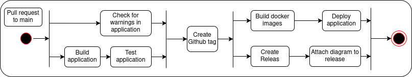

\begin{center}
\includegraphics[width=0.5\textwidth]{images/icon1.png}
\end{center}

\pagebreak

\tableofcontents

\pagebreak

# System
## Current Deployment


## Swarm Deployment


The system is in the process of being converted to use Docker Swarm instead of a docker network. 
This was to increase the crash resilience, by replicating the services, so if one where to crash the application would still function. Currently the Swarm can be setup using a terraform file, but it only deploys an empty Swarm. The step to populate the Swarm would happen as a step in the deployment chain, where we would ssh into the manager node and then deployed there. 
There were complications configuring the Prometheus client's configuration file, since the way the file is mounted to the service is different in docker Swarm as to the standard deployment. 

One thing that is missing in the terraform file is correctly configuring the firewalls so that the internal DNS network can correctly route between the services. 

* programmed in C# .NET 9 with ASP.NET as web framework and Blazor frontend.
* Containerised with docker.
* Onion architecture for code structure
* dependencies:
  * API
  * PostgreSQL
  * Digital Ocean
  * Prometheus
  * Grafana
  * Serilog
    * A powerful and widley used logging framework for .Net applications
  * Seq
    * A self-hosted search, analysis, and alerting server built for structured logs and traces. Simpel and well suited for .Net applications
# Process

## Provisioning
Vagrant was used to provision virtual machines, specified with a Vagrantfile. In the Vagrantfile, you're able to provision several virtual machines 
at the same time (fx the web app and the database), define and install their dependencies. This allows for an easy, streamlined way to always provision
VM's without having to rely on a specific user interface from various VM providers. This means, that we are able to use the Vagrantfile with several providers,
only having to change the vm.provider.

## Workflow
For our entire developing process we've used trunk-based development with each feature being developed in a separate branch. 
We use GitHub actions for CI/CD and GitHub issues for task management. Our workflows include building, testing and deploying the code.
On each pull request to the main branch, we run first run the 'changes-to-pr-to-main' that checks if the pull request has a label followed by 'commit-pr-to-main'
which runs a handful of jobs:
* check-for-warnings
* build
* test
* run-simulation
* sonarqube-analysis



These jobs are there to ensure that the codebase still works as intended on the branch that the developer has worked on.
The important note is that the run-simulation could have http requests that could time out, however, we ensured that if
there was only a couple of timeouts we could deduce that the codebase still worked as intended. This was primarily to confirm
that if we had 10's or 100's of timeouts, we could be sure that the codebase was broken.

'***add section about what and how we monitor here'\
We monitor through the use of Prometheus and Grafana.
Our application expose an endpoint using the OpenTelemetry nuget package for exporting telemetry data that Prometheus can understand.
Prometheus then scrapes the endpoint with an interval of 5 seconds, configured in the Prometheus.yaml file.
Prometheus saves the data in a times series database. This database is queried by Grafana which visualises the data in a custom dashboard.
Our custom dashboard has been built on top of the "ASP.NET Core" dashboard published by the .Net Team (https://grafana.com/grafana/dashboards/19924-asp-net-core/).
We have added a few custom panels. The most interesting being a table that shows total amount of request per status code for each endpoint. 
Another useful panel we made plots the request duration of different endpoints.

Status code panel
```
label_join(
  http_server_request_duration_seconds_count{
    job="$job", 
    instance="$instance", 
    http_route!=""
  }, 
  "method_route", 
  " ", 
  "http_request_method", 
  "http_route"
)
```

Status code panel
```
rate(
  http_server_request_duration_seconds_sum{
    job="$job", 
    instance="$instance", http_route!=""
  }[5m]
) / rate(
  http_server_request_duration_seconds_count{
    job="$job", 
    instance="$instance", 
    http_route!=""
    } [5m]
)
```

'***add section about what and how we log here'
We rely on serilog for generating and sending logs to our log visualiser Seq. 
Over logging strategy is quite extensive, since we have had a lot of troubles with our application, we thought it was better to have more and then not keep them for as long, to see if they could help us sort out our errors/bugs. It is as follows
We log when we raise exceptions and when exceptions are caught, this to help us see how erros where propecated through the system.
We log execution time of methods called, this was done as to help us see if there wehere methods bottle necking us.
We log the input and output of methods called, this way we can observe if they behave like we expect them too.


## Security
We had set SonarQube up to comment on every pull-request we had made, to ensure that the pull-request had passed the quality gate.
A segment of this quality gate, was to ensure that there were no security hotspots. Not only did SonarQube show where the hotspots were,
but it also explained why this is a hotspot, and how to fix it. In our last release, we still had security hotspot, more specifically an
"Open Redirect Vulnerability". This vulnerability results in an "E-score", but the rest is rate B or above. 
This could have been fixed, by creating a "allow-list" of safe relative paths to redirect to.

## Scaling
Regarding the scaling of our application, we are in the transition of moving from docker compose to docker swarm. However, we are using docker compose that composes
an API and MiniTwit dockerfile. Our intentions are to set up a declarative IaC using Terraform and with that set up a docker swarm cluster that can handle the scaling of our application.
Unfortunately as of now, we haven't fully integrated this structure because of some complications with the implementation.

sticky-notes:


## AI-assistant

The use of Chat-GPT has been used to some extent. Fx to more easily understand (at the time) complex notions in the topic of operations.
Various Dockerfiles were created with the assistance of AI, in order to more effectively "learn-by-doing". 
Furthermore, the assistance of AI proved efficient when having to translate the python api into C#. Problems did arise from this, though.
As an example, the AI rewrote the returned status codes, which meant that it wasn't compliant with the simulator. This ended up being an achilles
heel, since we spent a lot of time trying to diagnose the problem with the simulator.


# Reflections
The difficulties of the project were primarily to translate the simulation_api from python to C#, but also in implementing
new features as well as learning new and unfamiliar technologies that should be integrated with the project.  
## Evolution

Throughout the project there has been a division in the group between developing the new implementations to the web app
and operating these feature with CI/CD pipelines.
* Technical dept

### 'Dev' and 'Ops'
In the beginning of the project we had a lot of work that needed to be done. This was for instance translating the simulation whilst
also setting up the CI/CD pipelines. We also had to start using containerisation with docker and vagrant. This led to a split in the group
between the developers, who started translating the simulation to C#, and the operators, who started setting up the CI/CD and containerisation.
The difficulties lied in the communication between these two groups and how both parties could get up to speed with their respective work they've made.
A logbook was created to keep track of any work that has been done, but was unfortunately disregarded by other tasks and hasn't been updated since 07/02/25 (according to the log.md file).


### Refactoring

When rewriting the code to C# and adhering to the 'minitwit_sim_api.py' from session3, we weren't thorough enough when analyzing the specs.
This resulted in us pushing code to production, which 'seemingly' followed specs from the aforementioned file.
After long contemplation on why it didn't work, we took a step back and properly analyzed the api specs.
Lesson: Do it right the first time.


## Operation

### Logging
We had an experience, before we were introduced to logging in class, where our VM crashed due to extensive (and redundant) logging. We logged to console, docker logs and files.
This resulted in the bloating our Digital Ocean droplet with sizeable logs. What could be done differently, was to make to only log
once and automatically delete old ones which weren't needed anymore.

### CPU overload
We experienced a CPU overload in our droplet. The CPU would spike to 100% and sometimes exceeding that (due to Digital Ocean limiting the CPU size of the droplet).
This resulted in a crash of the droplet. Unfortunately, as of now (9/5/2025) we haven't found the reason for why this is happening.
For future reference we should have a more thorough testing suite.

## Maintenance
* docker compose up --build
* grafana and prometheus